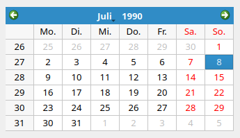
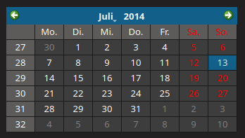

# calfenster

[](https://github.com/RainerKuemmerle/calfenster/actions/workflows/ci.yml)   [](https://github.com/pre-commit/pre-commit)

calfenster displays a simple calendar widget. Its primary use case is integration into a taskbar launcher to quickly see a calendar widget. The widget shown is Qt's [QCalendarWidget](https://doc.qt.io/qt-6/qcalendarwidget.html).

Currently, calfenster is only tested on Linux but might run also on other platforms.

Look & feel can be adjusted by Qt theme, for example, using qt5ct / qt6ct depending on the Qt version of choice.

| Light Theme | Dark Theme |
| ------------- | ------------- |
|  |  |

## Usage

```
$ ./calfenster -h
Usage: ./calfenster [options] command
A simple GUI calender.

Options:
  -v, --version  Displays version information.
  -h, --help     Displays help on commandline options.
  --help-all     Displays help including Qt specific options.
  --timezones    Print a list of time zones and exit.

Arguments:
  command        prev | next: Show previous or next month
```

`calfenster` upon starting shows _today_ as the highlighted date. Launching a second time will terminate the previously started instance by default. If valid commands are specified, `calfenster` will interact with the previously started instance.

## Configuration

calfenster can be configured using a configuration file. The file is located in `~/.config/calfenster/calfenster.conf`. If not found, fallback to `/etc/xdg/` instead of `$HOME`. See [QSettings](https://doc.qt.io/qt-6/qsettings.html#locations-where-application-settings-are-stored) for further and platform specific details. If none found a default configuration will be stored.

### Example

Below an example configuration file featuring the default settings.

```INI
[General]
customize_window=true
frameless_window=true
show_grid=true
skip_task_bar=true
window_no_shadow=false
window_position=mouse
window_stays_on_bottom=false
window_stays_on_top=true
```

### Options

* `customize_window=<boolean>` defaults to `true`.
  Controls whether the window has the default window title hints.
* `frameless_window=<boolean>` defaults to `true`.
  If activated produces a frameless window.
* `locale=<str>` defaults to `""`, i.e., the system's default locale.
  The entry `locale` allows to override the environment locale. It also determines calendar related settings such as the first day of the week.
* `show_grid=<boolean>` defaults to `true`.
  Renders the calendar with a grid in between cells.
* `skip_task_bar=<boolean>` defaults to `true`.
  Asks the window manager to skip showing the window in the taskbar.
* `window_no_shadow=<boolean>` defaults to `false`.
  If supported deactivate the window's shadow.
* `window_position=<str>` defaults to `mouse`.
  If `mouse` positions the window next to the mouse cursor.
* `window_stays_on_bottom=<boolean>` defaults to `false`.
  The window shall stay on bottom of all windows.
* `window_stays_on_top=<boolean>` defaults to `true`.
  The window shall stay on top of all windows.

### Fonts

Optionally, the fonts for the calendar and the header can be specified. The default font is Qt's system font.

```INI
[Calendar]
font_family=Sans
font_size=10

[Header]
font_family=Sans
font_size=10
```

* `font_family=<str>` defaults to Qt's default font family.
  The font family to use for display.
* `font_size=<int>` defaults to Qt's default font size.
  The font size to use for display.

### Clocks

Optionally, a list of dates/times can be displayed if specified in the configuration file. The clocks will be updated with ~1Hz. For example, we can display the local time of New York as well as Berlin as follows:

```INI
[Clocks]
size=2
1\label=New York
1\tz=America/New_York
1\format=
2\label=Berlin
2\tz=Europe/Berlin
2\format=m d HH:MM:SS
```
In the following `N` is an integer number with the range `[1, size]`.

* `size=<int>` defaults to 0.
  How many clocks are configured in total
* `N\label=<str>` defaults to "Clock N"
  Display label of the time zone.
* `N\tz=<timezone>` defaults to local time.
  The timezone to use for this clock.
* `N\format=<str>` defaults to "dd MMM yyyy HH:mm:ss ±tzoff"
  The format string for formatting the datetime, see [QDateTime](https://doc.qt.io/qt-6/qdatetime.html#toString) for details.
  Example format strings (assumed that the datetime is 21 May 2001 14:13:09.120):
  | Format          | Result        |
  | --------------- | ------------- |
  | `dd.MM.yyyy`    |	21.05.2001    |
  | `ddd MMMM d yy`	| Tue May 21 01 |
  | `hh:mm:ss.zzz`  |	14:13:09.120  |
  | `hh:mm:ss.z`    |	14:13:09.12   |
  | `h:m:s ap`      |	2:13:9 pm     |

## Compilation

`calfenster` only depends on Qt either in version 5 or 6. In particular, we require the modules core, gui, and network.

On Debian/Ubuntu you can install the required Qt development files with
```
# Qt6
sudo apt install qt6-base-dev qt6-tools-dev
# Qt5
sudo apt install qtbase5-dev qtbase5-dev-tools
```

Building follows the standard pattern of a CMake based project. For example, on Linux with the default Makefile generator.
```
mkdir build
cd build
cmake ..
make
```

You can use `cmake -DCALFENSTER_QTVERSION=5` to use Qt5 instead of the default Qt6.

## Acknowledgements

The functionality of `calfenster` is heavily inspired by [gsimplecal](https://github.com/dmedvinsky/gsimplecal). Basically when I started this project, I wanted a rather similar behavior but a slightly different look&feel.
